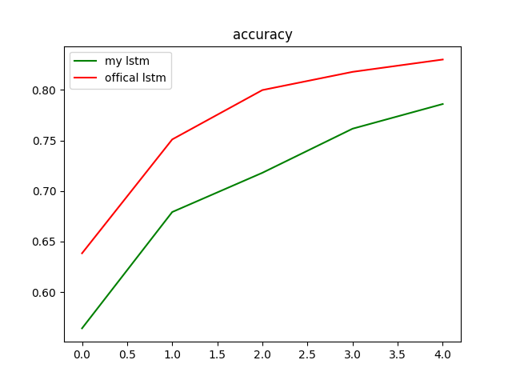
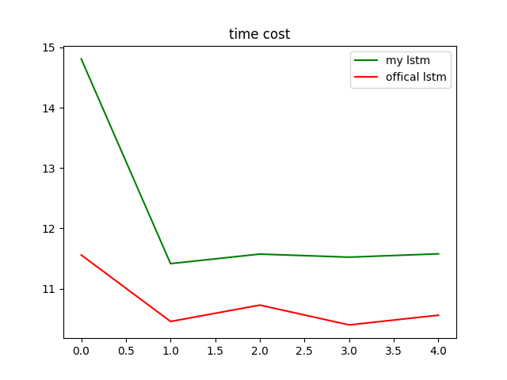

# 实现简单的lstm
根据lstm的公式及官方lstm的源码，实现了简单版本的lstm，加深对lstm的理解，通过在mnist数据集上面测试得到了一些结果。文件结构如下
```
├── data  保存一些测试结果
│   ├── lstm_acc.pkl 官方lstm正确率
│   ├── lstm_time_cost.pkl 官方lstm时间耗费
│   ├── my_lstm_acc.pkl 自己实现的lstm的正确率
│   └── my_lstm_time_cost.pkl 自己实现的lstm的时间耗费
├── lstm.py 自己实现的lstm
├── plt.py 绘图文件
├── readme.md 
├── recurrent.py tensorflow lstm及相关组件的源码
└── test.py 用于构建数据集，测试模型的文件
```
效果对比图  


